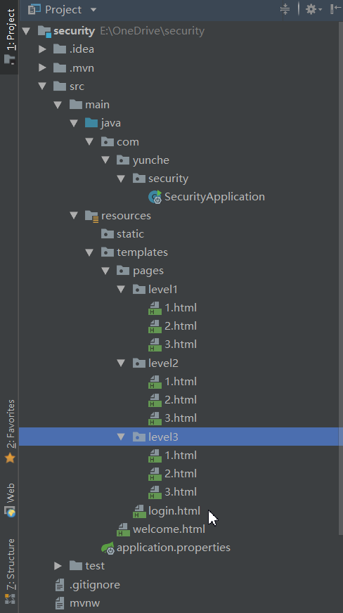
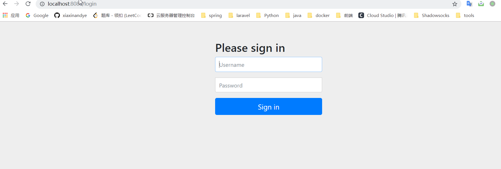
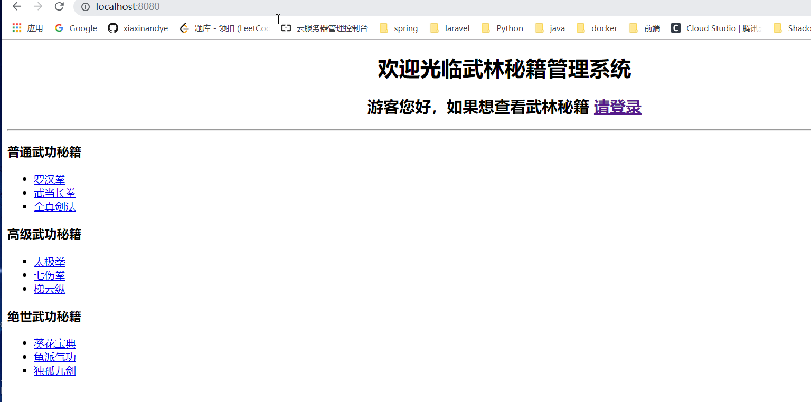
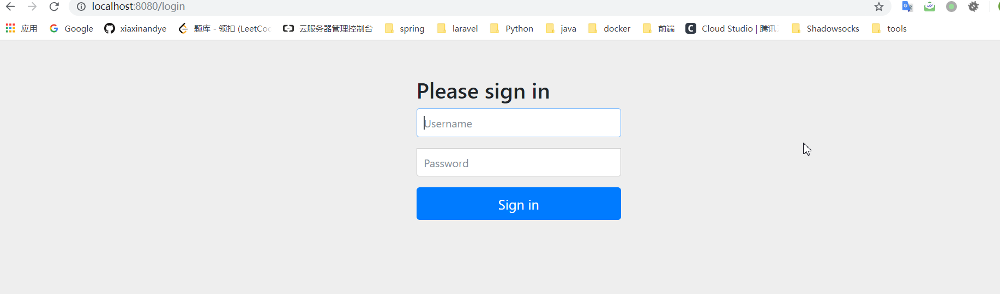
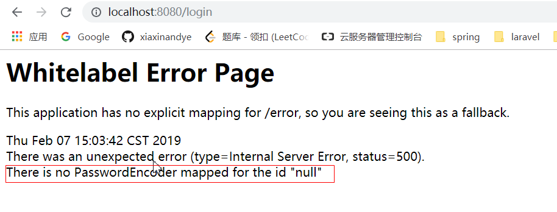

# 一、Spring Security 介绍

**Spring Security** 是针对Spring项目的安全框架，也是Spring Boot底层安全模块的默认技术选型。我们仅需引入**spring-boot-stater-security**模块，进行少量的配置，即可实现强大的安全管理功能。

**重要类**：

- **WebSecurityConfigurerAdapter**：定义Security策略。
- **AuthenticationManagerBuilder**：定义认证策略

# 二、Demo

使用 IDEA 通过 Spring Initializer 创建一个Spring Boot项目并选中 security 、web、thymeleaf模块。并导入[实验素材](experiment)（存储在我的github上,链接无效是因为图片、文件我是上传到github上的，请进入我的[github](https://github.com/xiaxinandye/spring-security-demo)观看）。

pom.xml:

```xml
<?xml version="1.0" encoding="UTF-8"?>
<project xmlns="http://maven.apache.org/POM/4.0.0" xmlns:xsi="http://www.w3.org/2001/XMLSchema-instance"
         xsi:schemaLocation="http://maven.apache.org/POM/4.0.0 http://maven.apache.org/xsd/maven-4.0.0.xsd">
    <modelVersion>4.0.0</modelVersion>
    <parent>
        <groupId>org.springframework.boot</groupId>
        <artifactId>spring-boot-starter-parent</artifactId>
        <version>2.1.2.RELEASE</version>
        <relativePath/> <!-- lookup parent from repository -->
    </parent>
    <groupId>com.yunche</groupId>
    <artifactId>security</artifactId>
    <version>0.0.1-SNAPSHOT</version>
    <name>security</name>
    <description>Demo project for Spring Boot</description>

    <properties>
        <java.version>1.8</java.version>
    </properties>

    <dependencies>
        <dependency>
            <groupId>org.springframework.boot</groupId>
            <artifactId>spring-boot-starter-security</artifactId>
        </dependency>
        <!--引入 thymeleaf-->
        <dependency>
            <groupId>org.springframework.boot</groupId>
            <artifactId>spring-boot-starter-thymeleaf</artifactId>
        </dependency>
        <dependency>
            <groupId>org.thymeleaf.extras</groupId>
            <artifactId>thymeleaf-extras-springsecurity5</artifactId>
        </dependency>
        <dependency>
            <groupId>org.springframework.boot</groupId>
            <artifactId>spring-boot-starter-web</artifactId>
        </dependency>

        <dependency>
            <groupId>org.springframework.boot</groupId>
            <artifactId>spring-boot-starter-test</artifactId>
            <scope>test</scope>
        </dependency>
        <dependency>
            <groupId>org.springframework.security</groupId>
            <artifactId>spring-security-test</artifactId>
            <scope>test</scope>
        </dependency>

    </dependencies>

    <build>
        <plugins>
            <plugin>
                <groupId>org.springframework.boot</groupId>
                <artifactId>spring-boot-maven-plugin</artifactId>
            </plugin>
        </plugins>
    </build>

</project>
```

项目文件树结构如下图：



打开KungfuController类：

```java
package com.atguigu.security.controller;

import org.springframework.stereotype.Controller;
import org.springframework.web.bind.annotation.GetMapping;
import org.springframework.web.bind.annotation.PathVariable;

@Controller
public class KungfuController {
   private final String PREFIX = "pages/";
   /**
    * 欢迎页
    * @return
    */
   @GetMapping("/")
   public String index() {
      return "welcome";
   }
   
   /**
    * 登陆页
    * @return
    */
   @GetMapping("/userlogin")
   public String loginPage() {
      return PREFIX+"login";
   }
   
   
   /**
    * level1页面映射
    * @param path
    * @return
    */
   @GetMapping("/level1/{path}")
   public String level1(@PathVariable("path")String path) {
      return PREFIX+"level1/"+path;
   }
   
   /**
    * level2页面映射
    * @param path
    * @return
    */
   @GetMapping("/level2/{path}")
   public String level2(@PathVariable("path")String path) {
      return PREFIX+"level2/"+path;
   }
   
   /**
    * level3页面映射
    * @param path
    * @return
    */
   @GetMapping("/level3/{path}")
   public String level3(@PathVariable("path")String path) {
      return PREFIX+"level3/"+path;
   }


}
```

此时我们访问：http://localhost:8080/



这说明了Spring Security已经生效了，并且它需要我们认证后才可以访问。所以我们需要编写一个类继承

**WebSecurityConfigurerAdapter** 来自定 Security 策略，并加上**@EnableWebSecurity**：开启WebSecurity模式：

```java
package com.yunche.security.config;

import org.springframework.security.config.annotation.web.builders.HttpSecurity;
import org.springframework.security.config.annotation.web.configuration.EnableWebSecurity;
import org.springframework.security.config.annotation.web.configuration.WebSecurityConfigurerAdapter;

/**
 * @ClassName: MySecurityConfig
 * @Description:
 * @author: yunche
 * @date: 2019/02/07
 */
@EnableWebSecurity
public class MySecurityConfig extends WebSecurityConfigurerAdapter {
    @Override
    protected void configure(HttpSecurity http) throws Exception {
        //super.configure(http);
        http.authorizeRequests().antMatchers("/").permitAll();
    }
}
```

此时，"/"请求全部允许通过，访问http://localhost:8080，就可以进入正常的首页了：



此时我们为了使不同的登录用户，查看到不同的武林秘籍（类似于普通用户和管理员），就可以让不同的登录用户根据一些规则成为**特定的角色**，此过程称为**认证**。然后再**授权**给不同的角色不同的访问权限。

此时我们还可以访问http://localhost:8080/level1/1，查看普通的武功秘籍信息，接下来我们就来实现**认证**与**授权**。

- 认证：这一过程显然是发生在登录中的，首先添加基于登录表单的认证：

  ```java
  @Override
  protected void configure(HttpSecurity http) throws Exception {
      //super.configure(http); //自定义规则
      http.authorizeRequests().antMatchers("/").permitAll()
          .and().formLogin()  //开启基于登录表单的认证
      ;
  
  }
  ```

  此时login请求会进入默认的登录表单认证，点击登录按钮，访问：http://localhost:8080/login，结果如下：

  

  MySecurityConfig:

  ```java
  @Override
  protected void configure(AuthenticationManagerBuilder auth) throws Exception {
      // super.configure(auth);
      auth.inMemoryAuthentication() // 添加基于内存的身份验证
              .withUser("zhangsan").password("z123").roles("VIP1") //将用户张三认证成VIP1角色
              .and()
              .withUser("lisi").password("l123").roles("VIP2") //将用户李四认证成VIP2角色
              .and()
              .withUser("wangwu").password("w123").roles("VIP3") //将用户王五认证成VIP3角色
      ;
  }
  ```

- 授权：

  ```java
  @Override
  protected void configure(HttpSecurity http) throws Exception {
      //super.configure(http); //自定义规则
      http.authorizeRequests().antMatchers("/").permitAll()
              .antMatchers("/level1/**").hasRole("VIP1") //允许VIP角色1访问/level1/**请求
              .antMatchers("/level2/**").hasRole("VIP2") //允许VIP角色2访问/level2/**请求
              .antMatchers("/level3/**").hasRole("VIP3") //允许VIP角色3访问/level3/**请求
              .and().formLogin()  //开启基于登录表单的认证
      ;
  
  }
  ```

  此时访问http://localhost:8080/level/1请求，就会要求进行身份验证：

  

  输入用户名和密码，会发现进入错误页面：

  

  查询官方文档可知，现在的版本(Spring Security 5)需要指定密码加密的格式:

  ```java
    @Override
      protected void configure(AuthenticationManagerBuilder auth) throws Exception {
          // super.configure(auth);
          auth.inMemoryAuthentication() // 添加基于内存的身份验证
                  .passwordEncoder(new BCryptPasswordEncoder()).withUser("zhangsan").password(new BCryptPasswordEncoder().encode("z123")).roles("VIP1") //将用户张三认证成VIP1角色
                  .and()
                  .passwordEncoder(new BCryptPasswordEncoder()).withUser("lisi").password(new BCryptPasswordEncoder().encode("l123")).roles("VIP2") //将用户李四认证成VIP2角色
                  .and()
                  .passwordEncoder(new BCryptPasswordEncoder()).withUser("wangwu").password(new BCryptPasswordEncoder().encode("w123")).roles("VIP3") //将用户王五认证成VIP3角色
          ;
      }
  ```

  随意点击一个武林秘籍阅读，输入相应角色的账号，密码，登录成功后会自动进入相应的页面。（注意，此时如果访问该角色无权访问的页面会得到一个403 forbidden）。

接下来添加一个点击按钮注销用户的功能：

1. 在授权规则里添加如下代码：

   ```java
   //开启自动注销的功能，默认规则，通过发送 /logout请求，来注销用户并清空session
   http.logout().logoutSuccessUrl("/"); //注销后来到首页
   ```

2. 编写form表单用于发送注销请求：

   welcome.html:

   ```html
   <h2 align="center">游客您好，如果想查看武林秘籍 <a th:href="@{/login}">请登录</a></h2>
   
   <form th:action="@{/logout}" method="post">
   <input type="submit" value="注销">
   </form>
   <hr>
   ```

此时就完成了注销功能。接下来，再来实现 2 个功能：

1. 用户登录后才显示注销按钮，未登录显示登录按钮。
2. 用户登录成功，显示 `xxx用户你好`,并根据用户角色的权限显示不同的首页。

首先，我们已经引入了thymeleaf 和 security 的整合依赖，然后为welcome.html 加上 `xmlns:sec="http://www.thymeleaf.org/extras/spring-security"`，这样当我们输入sec 时（security 的标签）会有自动提示。

修改好welcome.html 如下：

```html
<!DOCTYPE html>
<html xmlns:th="http://www.thymeleaf.org"
   xmlns:sec="http://www.thymeleaf.org/extras/spring-security">
<head>
<meta http-equiv="Content-Type" content="text/html; charset=UTF-8">
<title>Insert title here</title>
</head>
<body>
<h1 align="center">欢迎光临武林秘籍管理系统</h1>
<!--未验证才显示该元素-->
<div sec:authorize="!isAuthenticated()">
   <h2 align="center">游客您好，如果想查看武林秘籍 <a th:href="@{/login}">请登录</a></h2>
</div>

<!--验证后才显示该元素-->
<div sec:authorize="isAuthenticated()">
   <!--使用 principal.username取出用户名 -->
   <h1 align="center">用户<span sec:authentication="principal.username"></span>，您好~
      <!--使用 principal.authorities 取出用户的角色-->
   <br>您的角色是:<span sec:authentication="principal.authorities"></span>
   </h1>

   <form th:action="@{/logout}" method="post" >
      <input type="submit" value="注销" >
   </form>
</div>

<hr>

<!--当用户属于 VIP1角色时才显示该元素-->
<div sec:authorize="hasRole('VIP1')">
   <h3>普通武功秘籍</h3>
   <ul>
      <li><a th:href="@{/level1/1}">罗汉拳</a></li>
      <li><a th:href="@{/level1/2}">武当长拳</a></li>
      <li><a th:href="@{/level1/3}">全真剑法</a></li>
   </ul>
</div>

<div sec:authorize="hasRole('VIP2')">
   <h3>高级武功秘籍</h3>
   <ul>
      <li><a th:href="@{/level2/1}">太极拳</a></li>
      <li><a th:href="@{/level2/2}">七伤拳</a></li>
      <li><a th:href="@{/level2/3}">梯云纵</a></li>
   </ul>
</div>

<div sec:authorize="hasRole('VIP3')">
   <h3>绝世武功秘籍</h3>
   <ul>
      <li><a th:href="@{/level3/1}">葵花宝典</a></li>
      <li><a th:href="@{/level3/2}">龟派气功</a></li>
      <li><a th:href="@{/level3/3}">独孤九剑</a></li>
   </ul>
</div>


</body>
</html>
```

还可以添加上 `记住我`功能，再这之前，我们需要自定义登录页面，使用我们自己的登录页面：

```html
<!DOCTYPE html>
<html xmlns:th="http://www.thymeleaf.org">
<head>
<meta charset="UTF-8">
<title>Insert title here</title>
</head>
<body>
   <h1 align="center">欢迎登陆武林秘籍管理系统</h1>
   <hr>
   <div align="center">
      <form action="" method="post">
         用户名:<input name=""/><br>
         密码:<input name=""><br/>
         <input type="submit" value="登陆">
      </form>
   </div>
</body>
</html>
```

在 security 授权策略中，加上：

```java
http.formLogin().loginPage("/userlogin"); //登录页为发送/userlogin 后返回的页面
```

并将原来链接中的login 替换为 userlogin

```html
<h2 align="center">游客您好，如果想查看武林秘籍 <a th:href="@{/userlogin}">请登录</a></h2>
```

```html
<!DOCTYPE html>
<html xmlns:th="http://www.thymeleaf.org">
<head>
<meta charset="UTF-8">
<title>Insert title here</title>
</head>
<body>
	<h1 align="center">欢迎登陆武林秘籍管理系统</h1>
	<hr>
	<div align="center">
		<form th:action="@{/userlogin}"method="post">
			用户名:<input name="username"/><br>
			密码:<input name="password"><br/>
			<input type="checkbox" name="remember"> 记住我<br/>
			<input type="submit" value="登陆">
		</form>
	</div>
</body>
</html>
```

```java
//开启记住我功能，如果能够接收到 name 为 remember 的表单元素， 默认过期时间为14天
http.rememberMe().rememberMeParameter("remember");
```

# 三、参考资料

尚硅谷.Spring Boot 高级